# PyPTO Toolkit v4 Extension User Guide

English | [简体中文](README.zh.md)

PyPTO Toolkit v4 is an end-to-end development extension for the PyPTO 3.0 framework. It visualizes compilation and runtime states and provides operator development workflow capabilities, helping developers understand PyPTO 3.0 and improve operator development, debugging, and performance tuning efficiency.

> For complete PyPTO 3.0 usage instructions, see the [PyPTO Toolkit documentation](https://www.pypto.ai/pypto-tools/). The documentation source is under [`docs/`](./docs/), and the latest extension package is available from [Releases](https://github.com/hw-native-sys/pypto-tools/releases/latest).

## Key Features

### Chip-level Task Records

- **Chip Swimlane:** `chip_swimlane_records.json` (compatible with `l2_swimlane_records.json`) visualizes on-chip tasks and statistics, analyzes task dependencies using `deps.json`, and highlights existing critical-path results.

- **Task Dependency Graph:** `deps.json` visualizes dependencies between tasks and analyzes redundant dependencies.

- **Function Performance Table:** `name_map*.json`, together with swimlane data in the same directory, aggregates invocation count and maximum, minimum, and average duration by function.

- **Open Runtime Results:** Chip-level runtime results are typically generated under `build_out/*/dfx_outputs`. Right-click a supported file and select `PyPTO Toolkit: Open File` to preview it in the extension.

### PyPTO Pass Records

- **IR Trace Diff:** Compares IR snapshots under a `passes_dump` directory and displays changes introduced by each pass.

## Chip Swimlane

- **Open a Swimlane**

  Right-click a swimlane JSON file and select `PyPTO Toolkit: Open File`. The number of views depends on the `--enable-chip-swimlane` collection level. A full record contains the Worker View, Scheduler View, AICPU Scheduler, and AICPU Orchestrator.

  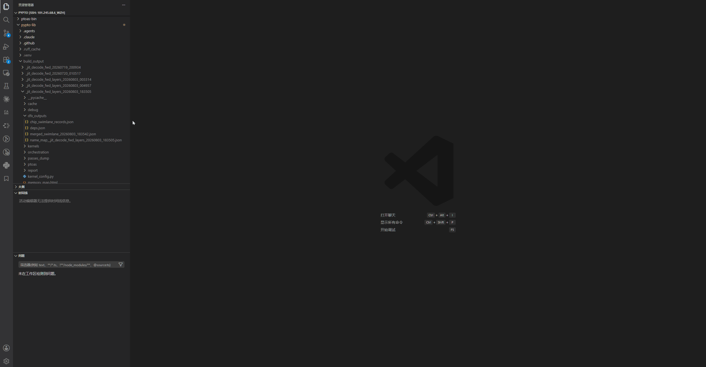

- **Inspect Task Details**

  Select a task to view its details in the lower panel. When a matching `deps.json` exists in the same directory, tasks connected by dependencies are also shown. Set the task dependency depth to control the maximum number of dependency levels displayed in the swimlane.

  Selecting an SPMD task highlights all SPMD tasks with the same `func_name` and `task_id`. On a dependency path, only the first matching SPMD task is shown to prevent excessive dependency lines from obscuring the view.

  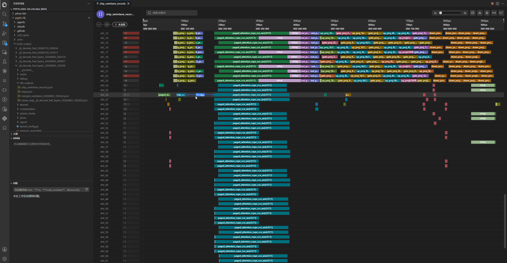

- **Search for Tasks**

  Enter a `func_name` or Task ID in the search box to locate matching tasks with a fuzzy search.

  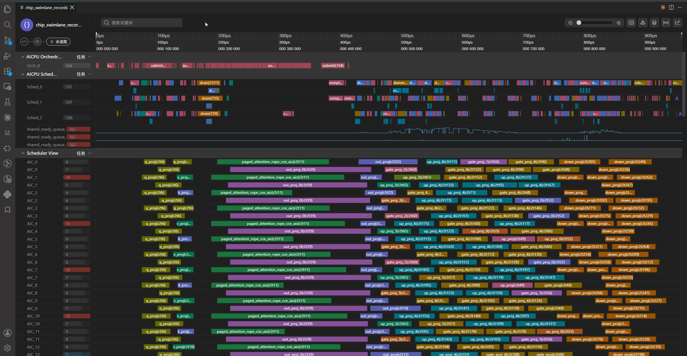

- **Export a Swimlane**

  Export the swimlane as a PNG image.

  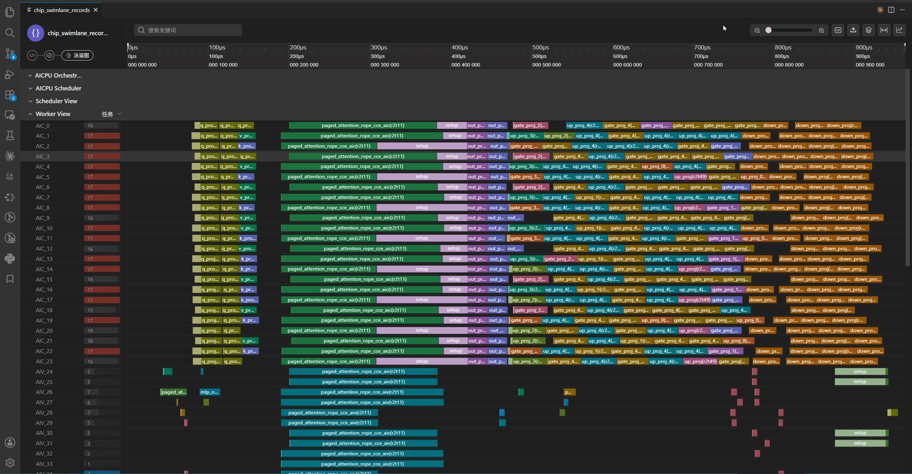

- **Add Time Markers**

  Select the secondary time axis to add a marker. Select a marker to delete or edit it.

  

  Each marker displays its timestamp. Select the marker again to close the action panel.

  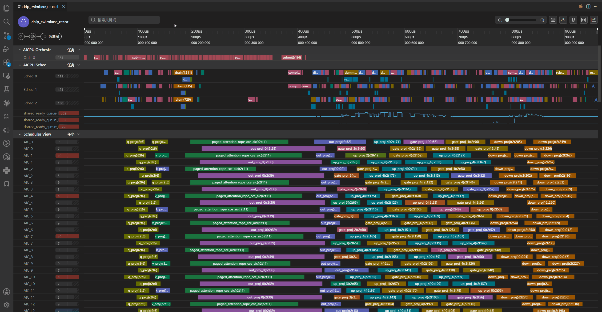

  You can also right-click a task and use the marker tool to mark the start and end of the selected task or identically named SPMD tasks.

  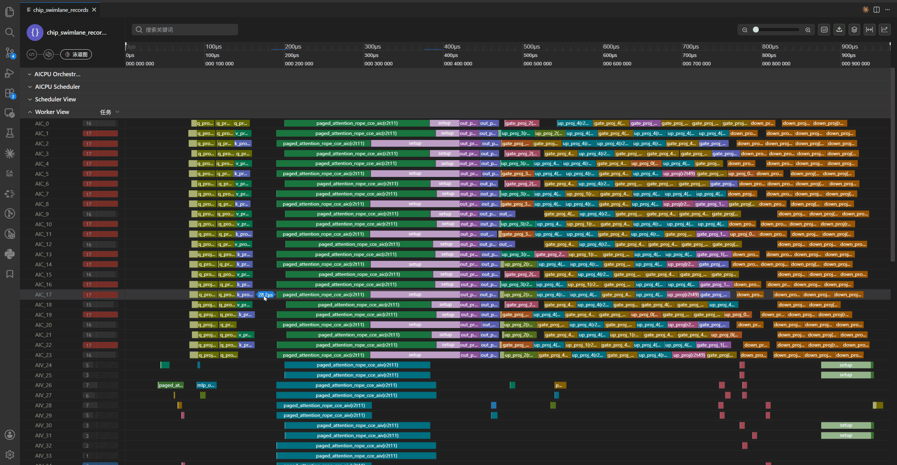

- **Performance Panel**

  Select **Performance Statistics** in the upper-right corner to view the performance report. Selecting a task in the report locates the corresponding task in the swimlane.

  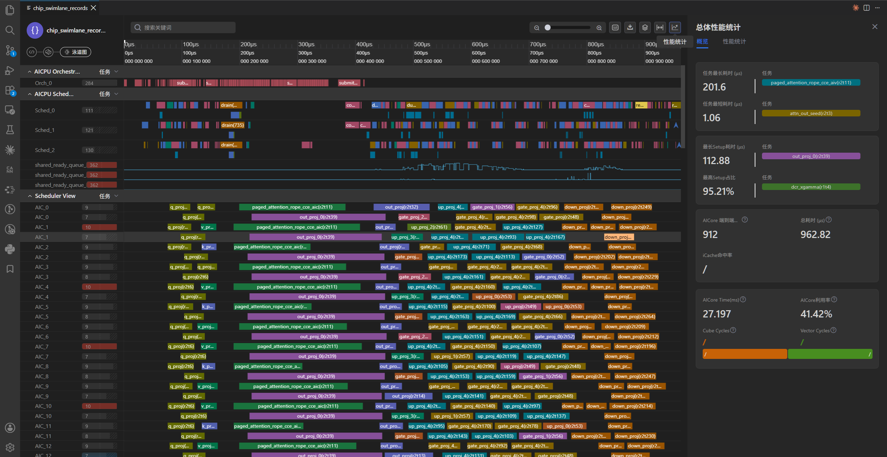

- **Pin a Lane**

  Hover over the left side of a lane to display the pin icon, then select it to pin the lane to the top.

  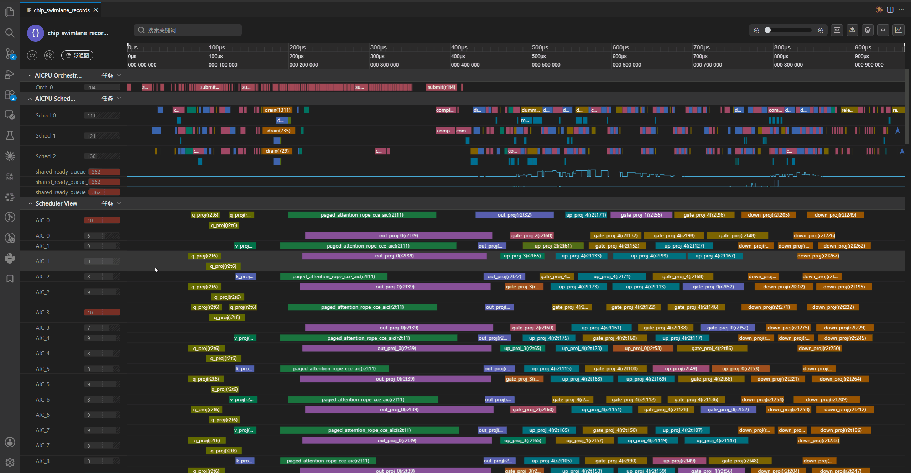

- **Configure Setup Display in the Worker View**

  Select **Rendering Settings** in the upper-right corner to configure whether the setup phase is displayed separately in Worker View task records. You can also hide setup entirely.

  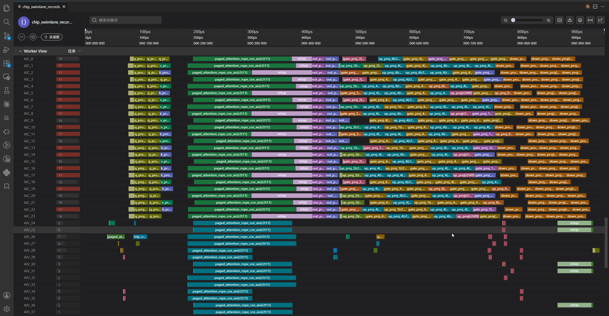

- **Highlight a Critical Path**

  The critical-path analysis tool generates `CPM_observed.json` and `CPM_static.json` under `dfx_outputs`. Open **Rendering Settings** and select the required critical-path result. In the Worker View, tasks outside the critical path lose their color and cannot be selected.

  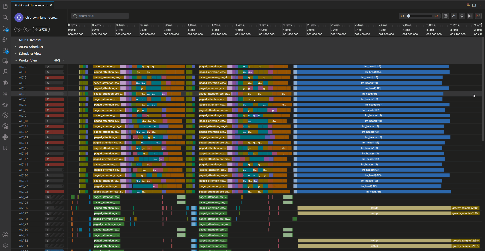

- **Keyboard and Mouse Shortcuts**

  | Shortcut | Function |
  |---|---|
  | Mouse wheel | Move vertically |
  | `Ctrl` + left mouse button | Move horizontally |
  | `Ctrl` + mouse wheel | Zoom |
  | `Alt` + left mouse button | Measure a time interval manually |
  | `w` / `s` (configurable) | Zoom in/out |
  | `a` / `d` (configurable) | Move horizontally |

## Pass Records

- **Open IR Pass Trace**

  Right-click a `passes_dump` directory to inspect IR changes introduced by compiler passes. You can filter changed and unchanged passes and filter differences by function.

  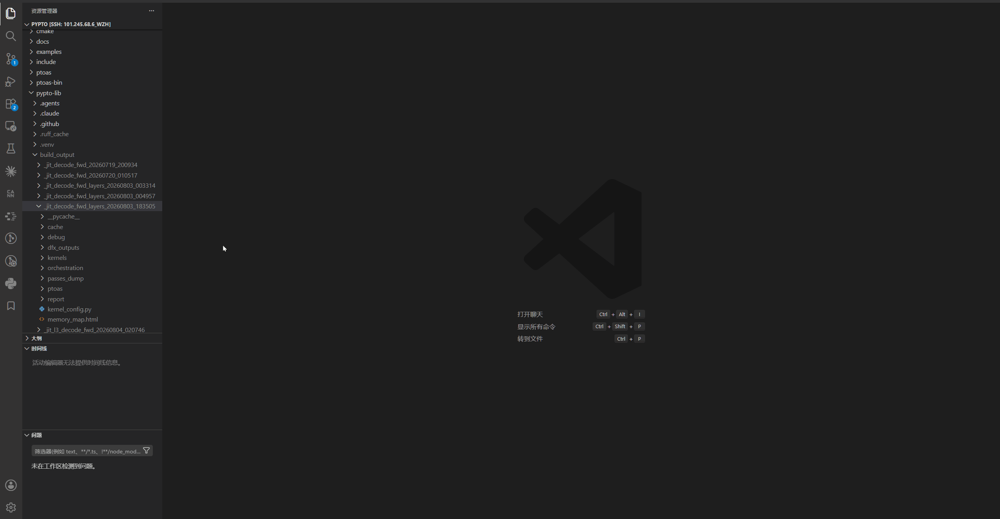

## Other Helper Features

- **Close All Pages Opened by PyPTO Toolkit**

  When multiple pages are open, use `PyPTO Toolkit: Close all tool page` to close every page opened by the extension.

  

## Feedback Channel

If you have any questions or suggestions, open an issue at [https://github.com/hw-native-sys/pypto-tools](https://github.com/hw-native-sys/pypto-tools/issues).

## Disclaimer

### 1. Scope of Application

This License Agreement (hereinafter “this Agreement”) governs the non-exclusive use of the PyPTO Toolkit (hereinafter “PyPTO Toolkit”) on Huawei AI processors within the territory of the People’s Republic of China between you and any company you are authorized to represent (collectively referred to as “you” or “your”) and Huawei Technologies Co., Ltd. and its affiliates (collectively referred to as “Huawei”).
You may download, install, and use (hereinafter “accept”) the PyPTO Toolkit in accordance with this Agreement only after agreeing to its terms. If you do not agree to this Agreement or lack the capacity to enter into this Agreement as described herein, you must not download, install, or use the PyPTO Toolkit.
This Agreement does not apply to open-source software contained in the PyPTO Toolkit. For the avoidance of doubt, open-source and third-party software included in the PyPTO Toolkit may be governed by separate license terms. In the event of any conflict between the provisions of this Agreement and any third-party license terms, the third-party license terms shall prevail only to the extent necessary to resolve the conflict.

### 2. Definitions

2.1 “PyPTO Toolkit” means the PyPTO Toolkit software, documentation, and updates thereof developed and maintained by Huawei, published on the webpage where this Agreement is located, and intended exclusively for use on Huawei AI processors.

2.2 “CANN” means Compute Architecture for Neural Networks, the end-to-cloud consistent heterogeneous computing architecture launched by Huawei for artificial intelligence.

2.3 “User” means an individual or entity that has entered into this Agreement with Huawei to download and use the PyPTO Toolkit.

2.4 “Object Code” means computer-executable program code in binary form.

2.5 “Source Code” means software code written in accordance with programming language specifications, uncompiled, and readable by humans.

2.6 “Open-Source Software” means any Source Code or Object Code subject to an “Open Source License.” Software provided in Source Code form but not publicly distributed in the PyPTO Toolkit is not Open-Source Software. An “Open-Source License” means a type of software license that allows users to freely use, modify, and redistribute the software and its source code, while complying with certain conditions set by the license.

2.7 Huawei AI Processors mean AI chipsets (i) branded with "Ascend", "Kirin", "Yueying" or other brands owned or controlled by Huawei; or (ii) manufactured (including have manufactured), supplied (including have supplied) or designed (including have designed) by Huawei.

### 3. Scope of License

Subject to your full compliance with all terms of this Agreement during its term, Huawei grants you, as a User, a non-exclusive license to:

(1) download and install the PyPTO Toolkit;

(2) develop software exclusively for use on Huawei AI processors based on the PyPTO Toolkit;

(3) compile software exclusively for use on Huawei AI processors based on the PyPTO Toolkit;

(4) test software exclusively for use on Huawei AI processors based on the PyPTO Toolkit;

(5) diagnose software exclusively for use on Huawei AI processors based on the PyPTO Toolkit;

(6) use software exclusively for use on Huawei AI processors in other ways based on the PyPTO Toolkit.

### 4. Use Restrictions

4.1 Except as expressly permitted in this Agreement, you shall not:

(1) use, copy, disclose, distribute, or publicly display the PyPTO Toolkit;

(2) share, publish, rent, or lease the PyPTO Toolkit to any third party;

(3) assign your rights or obligations under this Agreement or transfer the PyPTO Toolkit;

(4) modify, adapt, or translate the PyPTO Toolkit, in whole or in part;

(5) reverse engineer, decompile, disassemble, or attempt to derive the Source Code of the PyPTO Toolkit by any other means;

(6) circumvent or breach any technological restriction in the PyPTO Toolkit;

(7) use the PyPTO Toolkit on non-Huawei AI processors;

(8) run software that incorporates the PyPTO Toolkit on non-Huawei AI processors;

(9) modify or translate software incorporating the PyPTO Toolkit for use on non-Huawei AI processors;

(10) remove, obscure, block, or modify any notice of Huawei or its suppliers contained in the PyPTO Toolkit materials;

(11) include the PyPTO Toolkit in any malicious, deceptive, or unlawful plan or product, or use it in any unlawful manner;

(12) modify, create derivative works of, link to, integrate, or distribute non-open-source portions of the PyPTO Toolkit in such a way that any part becomes Open-Source Software;

(13) distribute non-open-source portions of the PyPTO Toolkit independently in Source Code form or integrated with other software;

(14) use the PyPTO Toolkit obtained under this Agreement for intellectual property infringement analysis or forensic purposes against Huawei or Huawei’s customers;

(15) disclose PyPTO Toolkit-related data (including but not limited to performance benchmark data) publicly without Huawei’s prior written consent;

(16) use batch download tools, crawlers, or similar means to download the PyPTO Toolkit.

4.2 You may not use the PyPTO Toolkit or any Huawei brand to provide any quality warranty or guarantee for software you develop or services you provide. You assume full responsibility to your customers for any updates, support obligations, or other obligations or liabilities arising from the distribution of your products or services, and you shall defend Huawei against any claims, lawsuits, or expenses arising from disputes or litigation related to the software you develop or services you provide.

4.3 The rights granted to you under this Agreement are non-transferable without Huawei’s prior written consent. You may transfer the PyPTO Toolkit received under this Agreement and all your rights hereunder only in connection with a change of ownership, merger, acquisition, sale, or transfer of all or substantially all of your business or assets to another party (collectively “Transferee”), provided that you:
(i) notify Huawei in writing by letter of the transfer, identifying (a) the Transferee and your legal entity, (b) the specific PyPTO Toolkit being transferred, (c) that you retain no copies of the PyPTO Toolkit or any portion thereof, and (d) that the Transferee has agreed in writing to be bound by all terms and conditions of this Agreement.

### 5. Updates

Huawei may update the PyPTO Toolkit at any time. Unless such updates are accompanied by separate license terms, they shall be deemed part of the PyPTO Toolkit under this Agreement. You agree that Huawei is not required to notify you in advance of any update. While Huawei generally seeks to maintain version compatibility, Huawei does not guarantee that updates will be backward compatible in all cases.

### 6. Ownership

All right, title, and interest in and to the PyPTO Toolkit and all copies thereof remain vested in Huawei. The PyPTO Toolkit is protected by copyright laws and international treaty provisions. You shall not remove any copyright or other proprietary notices from the materials. You agree not to reproduce the PyPTO Toolkit except as expressly authorized herein. Except for the express rights granted to you in this Agreement, no other rights or licenses are granted to you hereunder, whether by implication, estoppel or otherwise. In particular, Huawei does not grant you any express or implied rights under any patents, copyrights, trademarks, or trade secrets of Huawei.

### 7. Feedback

Any materials, information, comments, suggestions, ideas, or other input that you provide to Huawei in connection with your use of the PyPTO Toolkit (collectively, “Feedback”) is provided on a non-confidential basis. You hereby grant Huawei a non-exclusive, perpetual, irrevocable, royalty-free, worldwide license to use, copy, modify, create derivative works of, publicly display, disclose, distribute, sublicense, and otherwise exploit the Feedback and all data, images, audio, text, and other content contained therein (including any derivative works) for any commercial or non-commercial purpose and in any manner whatsoever.
If such Feedback relates to features, functionality, or improvements, you further grant Huawei a non-exclusive, perpetual, irrevocable, royalty-free, worldwide patent license (including the right to sublicense) under any patents or patent applications owned or controlled by you that are necessarily infringed by implementing such Feedback.

### 8. Confidentiality

If no separate confidentiality agreement exists between you and Huawei regarding the use of the PyPTO Toolkit, the following provisions shall apply.
The PyPTO Toolkit constitutes confidential information of Huawei and may be used solely for the purposes expressly permitted under this Agreement. You shall protect Huawei’s confidential information with at least the same degree of care that you use to protect your own confidential information of a similar nature, but in no event less than reasonable care. You shall disclose confidential information only to your employees (including contractors and subcontractors who have executed confidentiality agreements with you) who have a legitimate need to know such information for the permitted purposes and who are bound by confidentiality obligations at least as protective as those contained herein. You shall be responsible for any breach of this Agreement by your employees, contractors, or subcontractors.

### 9. Limitation of Liability and Exclusion

To the maximum extent permitted by applicable law, in no event shall Huawei be liable for any direct, indirect, incidental, consequential, special, exemplary, or punitive damages arising out of or in connection with your use of the PyPTO Toolkit under this Agreement, including but not limited to: (i) loss of revenue; (ii) loss of actual or anticipated profits; (iii) loss of use of money; (iv) loss of anticipated savings; (v) loss of business; (vi) loss of opportunity; (vii) loss of goodwill; (viii) loss of use of software; (ix) loss of reputation; (x) loss of, damage to, or corruption of data; or (xi) any other indirect, incidental, special, or consequential damages or losses — whether foreseeable, foreseen, known, or otherwise — even if H has been advised of the possibility of such damages.

### 10. No Warranty

10.1 THE PyPTO TOOLKIT IS PROVIDED “AS IS” WITHOUT WARRANTY OF ANY KIND, WHETHER EXPRESS, IMPLIED, STATUTORY, OR OTHERWISE, INCLUDING BUT NOT LIMITED TO ANY IMPLIED WARRANTIES OF MERCHANTABILITY, FITNESS FOR A PARTICULAR PURPOSE, TITLE, NON-INFRINGEMENT, OR ANY OTHER WARRANTY ARISING BY STATUTE, COURSE OF DEALING, COURSE OF PERFORMANCE, USAGE OF TRADE, OR OTHERWISE.

10.2 Except to the extent prohibited by applicable law, Huawei does not warrant that the software in the PyPTO Toolkit (including any third-party or open-source software) will be error-free or operate without interruption. Huawei will use reasonable efforts to respond to and provide mitigation or patches for significant software vulnerabilities affecting product usability that are reported during the lifecycle of the PyPTO Toolkit, but does not warrant that Huawei will identify, test, or correct all defects. Furthermore, due to the evolving nature of intrusion and network attack techniques, Huawei does not warrant that the PyPTO Toolkit or any device, system, or network using the PyPTO Toolkit will be free from intrusion or attack.

### 11. Term and Termination

11.1 This Agreement commences upon your acceptance and continues until terminated. Huawei may terminate this Agreement immediately upon written notice if you fail to cure any material breach of this Agreement within thirty (30) days after receiving written notice thereof. You shall be liable for any losses caused to Huawei by such breach, including reasonable attorneys’ fees and litigation costs.

11.2 This Agreement shall automatically terminate upon your initiation of any lawsuit against Huawei or any lawsuit concerning the PyPTO Toolkit itself against any third party.

11.3 You agree to ensure that your customers provide at least the same level of protection to the PyPTO Toolkit as set forth in this Agreement. If any customer of yours violates this Agreement or infringes Huawei’s intellectual property rights in connection with the sale, use, or distribution of software developed by you that incorporates the PyPTO Toolkit, or in connection with the sale or use of Huawei AI processors containing the PyPTO Toolkit, you shall promptly take reasonable measures to stop such violation or infringement. If you fail to take effective measures, Huawei may terminate this Agreement. You shall be liable for any losses caused to Huawei as a result, including reasonable attorneys’ fees and litigation costs.

11.4 In addition to the foregoing liability, Huawei shall be entitled to seek injunctive relief with respect to any such violation or infringement.

11.5 Upon termination of this Agreement, you shall immediately return or destroy all copies of the PyPTO Toolkit and certify such destruction in writing upon Huawei’s request. Any valid distribution of the PyPTO Toolkit made by you prior to the effective date of termination shall remain unaffected by the termination.

11.6 Sections 1, 2, 4, 5, 6, 7, 8, 9, 10, 11, 12, and 14 shall survive any expiration or termination of this Agreement.

### 12. Audit

Upon thirty (30) days’ prior written notice, Huawei may audit your use of the PyPTO Toolkit to verify compliance with this Agreement. The audit may include, but is not limited to, examination of software functionality, applications, backup and archiving records, installation counts, copy counts, and distribution records. Huawei may designate a third-party auditor to conduct such audit on its behalf. You agree to cooperate fully with the audit and provide reasonable assistance, including access to relevant books, records, contracts, technical support documentation, order reports, and systems.

### 13. Export Control

13.1 You agree that the PyPTO Toolkit provided under this Agreement is intended solely for use on Huawei AI processors located within the territory of the People’s Republic of China. If you are an authorized user providing cloud services, you agree to offer services supported by the PyPTO Toolkit only to customers within the People’s Republic of China.

13.2 You acknowledge that the export or re-export of the PyPTO Toolkit or products incorporating the PyPTO Toolkit may be subject to export control laws and regulations. You shall not export or re-export the PyPTO Toolkit or any product incorporating it in violation of such laws or for any prohibited end-use.

### 14. General Provisions

14.1 This Agreement shall be governed by and construed in accordance with the laws of the People’s Republic of China, without regard to its conflict of laws principles. Any dispute arising out of or in connection with this Agreement that cannot be resolved through friendly negotiation shall be submitted to the exclusive jurisdiction of the competent people’s courts in Shenzhen, Guangdong Province, People’s Republic of China.

14.2 If any provision of this Agreement is held to be invalid, illegal, or unenforceable, the parties shall negotiate in good faith to replace such provision with a valid provision that most closely approximates the original intent. The remaining provisions shall continue in full force and effect.
